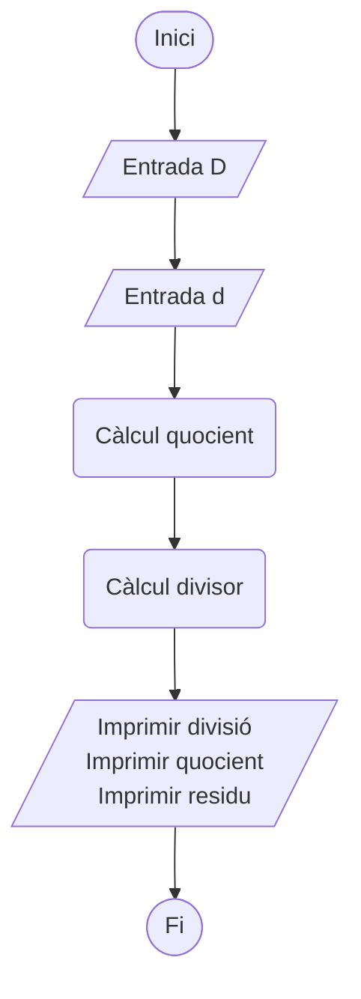

# Divisió entera, diagrama de flux

- Diagrama de flux
- Luis Rey Cabrerizo
- 2 de juny de 2024
- Versió 1
- Càlcul del quocient i residu de la divisió entera de dos nombres

Diagrama amb mermaid. El problema és veure'l fora de VSCode.
